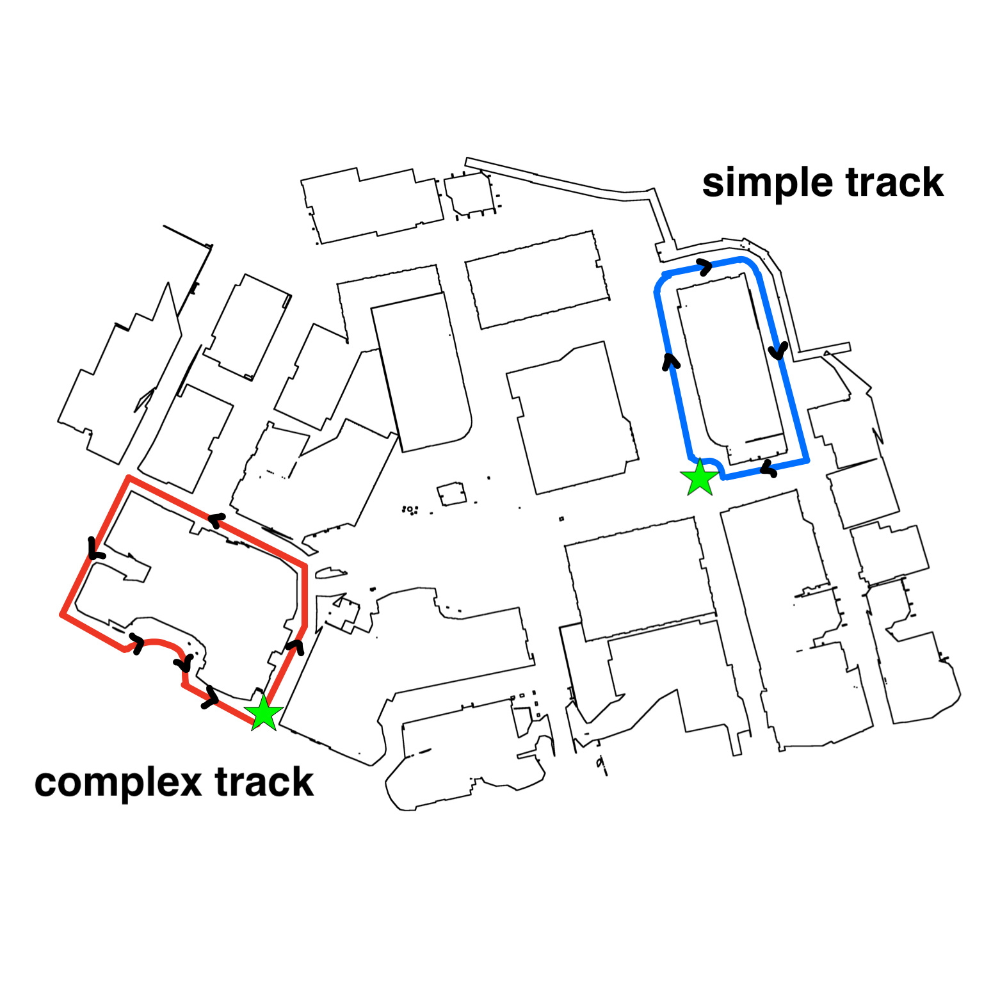
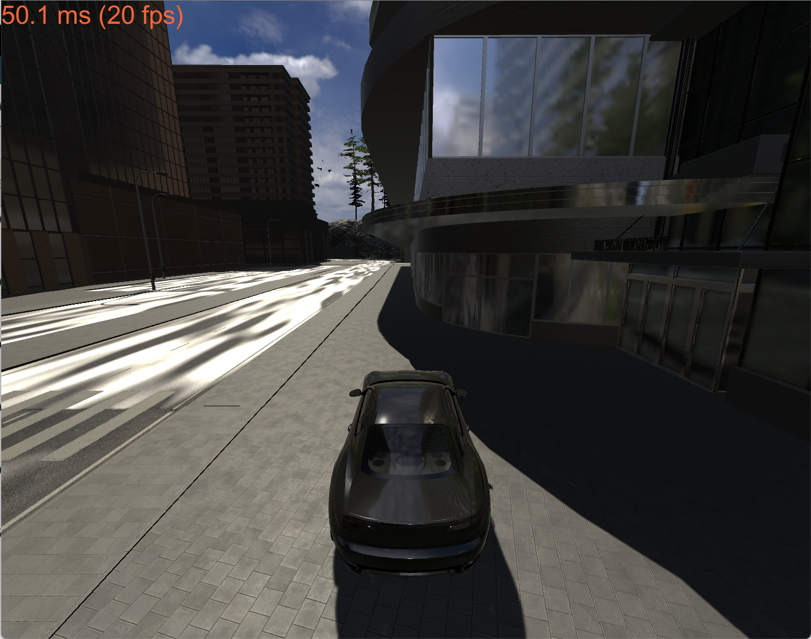
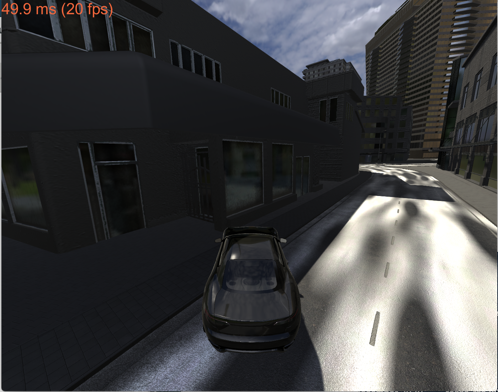

| Deliverable | Due Date              |
|---------------|----------------------------------------------------------------------------|
| Briefing (8 min presentation + 3 min Q&A) (slides due on [github pages](https://github.mit.edu/rss/website2021))  | Wednesday, March 17th at 1:00PM EST |
| Report (on [team github pages website](https://github.mit.edu/rss/website2021)) | Friday, March 19th at 11:59PM EST |
| Pushed code with speed logs | Friday, March 19th at 11:59PM EST |
| [Team Member Assessment](https://docs.google.com/forms/d/e/1FAIpQLScM6T3JsnlFQldhL_fVmAr9FkUILOjbXHM_nYxK280UZwJPww/viewform)  | Friday, March 19th at 11:59PM EST |

# Lab 3: Wall Following in TESSE

## Introduction
Welcome to the world of 3D! We're transitioning to using the realistic car simulator in TESSE for this lab. Make sure you've followed all the instructions in [TESSE setup handout](https://github.com/mit-rss/tesse_install) before proceeding.

In this week's lab you're going to work with your team to implement a wall follower in TESSE. This environment uses a realistic physics simulator, so you will need to account for delays in acceleration and deceleration. The car can tilt, and drift, which will add significant noise to received lidar data. In addition, the environment is dense with other buildings, lampposts, trees, and city fixtures.

The goal is to complete the two tracks described below autonomously without collisions, with an added challenge of maintaining an average speed comparable to the staff solution (see grading rubric). Unlike lab 2, you are allowed to vary your velocity so you are no longer restrained to publishing the set velocity from the parameter file. Note that it is fully possible to successfully complete this lab without doing so, however we gave you this option in case you wanted to optimize your solution for faster average speeds.

A good place to start would be to sit down with your new team and consolidate your wall follower code from last week's lab. You should be able to put your working code into a node like `wall_follower_tesse/src/wall_follower_tesse.py`, change the parameters to the appropriate TESSE parameters in `wall_follower_tesse/params_tesse.yaml`, and add your node to the launch file at `wall_follower_tesse/launch/wall_follower_tesse.launch` to get a minimal working wall follower in TESSE. See the Starter Code section below for more details on the file structure.

## Submission and Grading

From now on, for each lab, you will be publishing a report on your team's github pages website, giving an 8 minute briefing presentation (plus 3 minutes Q&A) together with your team, uploading the briefing slides to your github pages website, and submitting a [team member assessment form](https://docs.google.com/forms/d/e/1FAIpQLScM6T3JsnlFQldhL_fVmAr9FkUILOjbXHM_nYxK280UZwJPww/viewform). See the deliverables chart at the top of this page for due dates and times.

If you haven't already done so, follow the instructions for your team's [github pages website](https://github.mit.edu/rss/website2021), which will be hosting your lab reports. As part of this you will need to create an organization for your team on github.mit.edu called rss2021-[TEAM_NUMBER] and make sure all of your code is pushed there by the lab report deadline. At this time, the TAs will pull your team's report from your website. Please ensure that the report is complete and that you have linked to your presentation. Your team organization is also where you should push all of your lab code.

You can view the rubrics for the [lab report](https://docs.google.com/document/d/1iTIu6wThHpAwqRQ7rM10aH6TC9S9KXdV4stQZOIH1zE/edit?usp=sharing) and the [briefing](https://docs.google.com/document/d/1lTngqa15Z-5YGQjHZpm5xF9oeEbIdCOoywlrFIDO8K4/edit?usp=sharing) for more details on specific grading criteria. You will receive a grade out of 10 points for each. Your final lab grade will also be out of 10 points, based on the following weights:

| Deliverable Grade | Weight              |
|---------------|----------------------------------------------------------------------------|
| briefing grade (out of 10)  | 20% |
| lab report grade (out of 10) | 70% |
| average speed grade (out of 10) | 10% |

The average speed grade refers to how fast your racecar is able to complete the wall following tracks - see below for details on the tracks and how to use the starter code to obtain your racecar's average speed. The raw 10-point average speed grade (accounting for 10% of your total lab grade) is calculated as follows:

    5 * min(1, your_simple_speed / staff_simple_speed) + 5 * min(1, your_complex_speed / staff_complex_speed)

where your_simple_speed and your_complex_speed are the average speeds you achieve on the simple and complex tracks, respectively, and staff_simple_speed and staff_complex_speeds are the corresponding average speeds achieved by the staff solution. Thus if your solution achieves the same speeds as the staff solution, you will get full points for this section. The staff solution gets 7 m/s for the simple track and 4 m/s for the complex track. **In addition to including these numbers in your report and briefing, push a speed log for each track to the root of your repo by the lab report deadline (name them `speed_log-simple.txt` and `speed_log-complex.txt` respectively.)**

In your reports and briefings, use of video, screen shots, screen recordings etc. is highly recommended. Make quantitative and qualitative evaluations of your results. Make sure you demonstrate the ability of your car to successfully complete both tracks outlined below without collisions. Data on average speed (required for speed grade above) and collisions are good examples of metrics for evaluation, but feel free to also get creative - have a look at the Important Topic Details section below for inspiration. The rosbag recording functionality outlined below can also be a useful tool for evaluating your code and post-processing data, and tool such as rqt_multiplot and rviz are also helpful for visualization.

## Starter Code

Before starting, you will need to pull the master branch of `tesse-ros-bridge` (before doing so, you may want to save your IP addresses so that you can put them back into `tesse-bridge.launch` more easily afterwards)

    cd ~/racecar_ws/src/tesse-ros-bridge
    git checkout -- ROS/launch/tesse_bridge.launch
    git pull

You will also need to download the TESSE executable for this lab [here](https://drive.google.com/drive/folders/1wrwHy6pXzNmuwC8j3FCzVFqShZzP0Tfg?usp=sharing) - go to the folder corresponding to your host OS and download the latest executable (highest version number).

Fork this starter repository into your team github.mit.edu organization (rss2021-[TEAM_NUMBER]), and then clone your team's repository into your catkin workspace at `~/racecar_ws/src`.

Then rebuild your workspace with `catkin_make`:

    cd ~/racecar_ws
    catkin_make
    source devel/setup.bash

We have set up this repository as a ROS package called `wall_follower_tesse`. There is a skeleton launch file for you at `wall_follower_tesse/launch/wall_follower_tesse.launch`, as well as a parameter file at `wall_follower_tesse/params_tesse.yaml`. For a reminder on how to reference the parameters in your ROS node, see [this documentation](http://wiki.ros.org/rospy/Overview/Parameter%20Server).

You should set up your wall follower as a ROS node inside the `wall_follower_tesse/src` directory, similar to the structure of your 2D wall follower in Lab 2. Then, you should add your wall follower node to the `wall_follower_tesse.launch` file - you can follow the example of the way we currently launch the `record_speeds.py` node in `wall_follower_tesse/launch/speed_logger.launch` with all the parameters loaded.

Once you have added your node and are ready to test it, first start the TESSE executable on your host machine with `--client_ip_addr` set to your VM IP address (see the [TESSE setup handout](https://github.com/mit-rss/tesse_install) if you need a refresher on how to find this). Then, run the following command in a terminal within your VM (remember that your VM must be in host-only mode):

    roslaunch wall_follower_tesse wall_follower_tesse.launch

This will take care of starting a roscore if there is not one running already, launching the `tesse_ros_bridge` that allows your VM and host machine to communicate, and launching your own wall follower node (assuming you have added it to the launch file).

## Import Topic Details
While TESSE will use different topic names than the 2D wall follower, you can make use of the parameters in `params_tesse.yaml` as described above, which use the same naming convention as Lab 2 for many topics.

* `/tesse/drive`
    - [http://docs.ros.org/en/melodic/api/ackermann_msgs/html/msg/AckermannDriveStamped.html](http://docs.ros.org/en/melodic/api/ackermann_msgs/html/msg/AckermannDriveStamped.html)
* `/tesse/odom`
    - [http://docs.ros.org/melodic/api/nav_msgs/html/msg/Odometry.html](http://docs.ros.org/melodic/api/nav_msgs/html/msg/Odometry.html)
* `/tesse/front_lidar/scan`
    - [http://docs.ros.org/melodic/api/sensor_msgs/html/msg/LaserScan.html](http://docs.ros.org/melodic/api/sensor_msgs/html/msg/LaserScan.html)
* `/tesse/collision`
    - [https://github.mit.edu/rss/tesse-ros-bridge/blob/master/ROS/msg/CollisionStats.msg](https://github.mit.edu/rss/tesse-ros-bridge/blob/master/ROS/msg/CollisionStats.msg)
* `/tesse/imu/clean/imu`
    - [ http://docs.ros.org/melodic/api/sensor_msgs/html/msg/Imu.html]( http://docs.ros.org/melodic/api/sensor_msgs/html/msg/Imu.html)
* `/initialpose`
    - [http://docs.ros.org/en/melodic/api/geometry_msgs/html/msg/PoseStamped.html](http://docs.ros.org/en/melodic/api/geometry_msgs/html/msg/PoseStamped.html)
    - You should not need to publish messages directly to `/initialpose` in your code! This is helper topic that allows you to spawn your car around the scene with the "2D Pose Estimate" tool in rviz if you wish to use it. The correct way to spawn your car is by changing the parameter in `params_tesse.yaml`. However, this topic is here if you wish to test your wall follower in other places in the environment.

## Tracks and Spawn Points
You will be implementing a wall follower in tesse to complete a loop around two different buildings without collisions, and quickly. The tracks are shown in the map below with the direction you should be following, and you will be able to spawn your cars at the start of either track (indicated with green stars) with a parameter in `wall_follower_tesse/params_tesse.yaml`. We suggest you start with the simple course, but we expect you to complete both without collisions and analyze your performance and average speeds achieved in the reports and briefings.

There are two tracks you must complete. You can toggle which track your car spawns at by changing the `track` parameter in `params_tesse.yaml`. The two options are `wall_follower_simple` and `wall_follower_complex` for the simple and complex tracks respectively. **For the simple track, you will be required to follow the wall on the right side of the car. For the complex track, you will be required to follow the wall on the left side of the car.**

Simple track spawn POV, follow the right wall:

Complex track spawn POV, follow the left wall:

## Recording and Playing Back Rosbags with TESSE

Rosbags are a useful tool for recording various published messages when running your code and playing it back later. **You will need to record a rosbag whenever you run your wall follower node if you want to be able to extract the average speed afterwards (see next section).**

To record a rosbag while using TESSE and `tesse-ros-bridge`:
- Start the TESSE executable on your host machine with `--client_ip_addr` set to your VM IP address (see the [TESSE setup handout](https://github.com/mit-rss/tesse_install) if you need a refresher on how to find this).
- Run `roscore` in a terminal inside your VM.
- In a new terminal, navigate to `~/racecar_ws/src/tesse-ros-bridge/ROS/scripts` and run `./rosbag_record.bash` to start recording.
- In a new terminal, run the code that you want to record - this could be launching `tesse-ros-bridge` or your wall following code.
- When you're done running what you want to record, you can terminate it, and then terminate the rosbag recording script. You can also stop running the TESSE simulator. The output of the rosbag recording script will tell you what filename the rosbag was saved to in the `scripts` directory.
- Next, make sure to restamp the rosbag by running `./restamp_rosbag.py -i <input_rosbag_name.bag> -o <output_rosbag_name.bag>` where `<input_rosbag_name.bag>` is the filename that was specified in the recording script output and `<output_rosbag_name.bag>` must be a *different* name than the input name. (This step is important for setting the expected frame rate and imu rate for the bag file.)

To analyze and play back your rosbag file:
- You do not need to be running `tesse-ros-bridge` or the TESSE simulator while playing back the rosbag.
- You can view info regarding the recording, including what topics and how many messages of different types were published, by running `rosbag info <output_rosbag_name.bag>`.
- You can play back your recording by running `rosbag play <output_rosbag_name.bag>` - you will need to be running `roscore` in a separate terminal for this to work. If you run `rostopic list` or `rostopic echo <topic>` while playing back the recording, it will behave as it would have while the recorded code was running.

## Obtaining Average Speed

This section will explain how to use our helper node and script to obtain the average speed of your racecar as it completes the two tracks outlined above. For details on how this speed will factor into scoring, see the Grading section above.

We have written a node at `wall_follower_tesse/src/record_speeds.py` that keeps track of your racecar's forward velocity as it drives. In order to allow you to get maximum performance when running your wall follower nodes, we have separated the average speed extraction into a post-processing step that you will perform on a rosbag. See the previous section for how to record a rosbag of your racecar completing a wall following track. Once you have your rosbag restamped, proceed with the following steps to extract the average speed.

Launch the speed logger at `wall_follower_tesse/launch/speed_logger.launch` which launches only the speed logger node:

    roslaunch wall_follower_tesse speed_logger.launch

Then replay the rosbag in another terminal by running:

    rosbag play <path to rosbag.bag>

When the rosbag is finished replaying, you can terminate the speed logger as well - by default it will save the speed log at `~/.ros/speed_log.txt` when run via launch file, but **note that each time you run the speed logger node, this `~/.ros/speed_log.txt` location will be overwritten. If you want to save it, rename and/or move it.** You can quickly extract the average speed from the default location by running the following script with no command line arguments:

    cd ~/racecar_ws/src/wall_follower_tesse/src
    python average_speed.py

Alternatively, you can save multiple speed logs by renaming them and moving them around - and you can always run the speed averaging script at a later time by specifying the absolute path to the log file as a command line argument:

    cd ~/racecar_ws/src/wall_follower_tesse/src
    python average_speed.py <absolute path to log>

Note that the script will need you to use `/home/racecar` rather than the `~` shortcut when providing this path.

## Tips and Resources
* Use rviz! Rviz has a ton of nice visualizations you can plot using [markers](http://wiki.ros.org/rviz/DisplayTypes/Marker). Ideas for things to visualize include the trajectory your car took or the line you generated from linear regression to follow. Keep in mind plotting lots of things in rviz (or even running rviz at all) may slow your wall follower code (it certainly does on my 2015 Macbook) so your best bet is to record rosbags and play them back to analyze in the data in rviz in this case.
* Your node will respond slower if you have a lot of stuff running in your VM. You can check the rate at which your drive commands are being sent with `rostopic hz /tesse/drive`. If your wall follower was performing well before but suddenly seems broken, check that the speed at which you're publishing commands is fast enough.
* If your computer can handle it, increase the number of cores and RAM you give your virtual machine in VMWare settings.
* [rqt_multiplot](http://wiki.ros.org/rqt_multiplot) is a great tool for gathering and plotting data. Linked here so you know it exists :).
* You may find that your old solution in 2d simulation worked relatively well but is suddenly not as well-behaved in Tesse. Keep in mind that the realistic simulation environment adds a lot more noise and a simple proportional or PD controller may not be enough. You may want to look into [RANSAC](https://en.wikipedia.org/wiki/Random_sample_consensus) or other algorithms for robust wall following.   
